# Findings, Method & Error Correction

## Overview

This document describes the algorithm, error analysis, and correction methods used to OCR the RapidKL integrated fare table image into a 156×156 fare matrix.

## Pipeline

```
image/faretable.png
    ↓ crop_cells.py      (dynamic grid detection → 24,336 cell PNGs)
    ↓ crop_headers.py    (header cell PNGs)
    ↓ cells_to_csv.py    (OCR + symmetry voting + GTFS cross-check)
output-ocr/{stations.csv, columns.csv, fare_matrix_cells.csv, fare_matrix_cells.json}
```

## Image Processing Techniques

### Color Space Analysis (LAB)
Grid detection uses LAB color space median-color projection. The L channel (lightness) reveals cell boundaries as valleys in the projection profile, while A/B channels help distinguish the blue diagonal from yellow/white cells.

### Gradient-Based Peak Finding
Boundary positions are found by computing the gradient of the median-color profile and detecting peaks with `scipy.signal.find_peaks` (prominence-based). A two-pass refinement with Gaussian blur improves boundary accuracy to sub-pixel level.

### Adaptive Binarization
Multiple thresholding strategies handle varying cell backgrounds:
- **Otsu's method**: automatic threshold for dark-on-light cells
- **Inverted Otsu**: for light-on-dark (blue diagonal) cells
- **Min-channel masking**: `min(B,G,R) ≥ threshold` isolates white text on blue by exploiting that white has all channels high while blue has low R,G

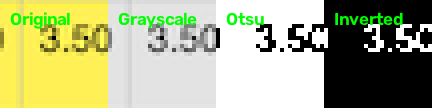

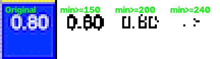

### Color-Based Segmentation
Blue diagonal cells are detected by sampling corner pixels: `B - R > 50` indicates blue background. This routes cells to the appropriate OCR recipe set.

### Multi-Scale Upscaling
Small cells (~27×29 px) are upscaled 6-8× before OCR using:
- **LANCZOS**: smooth interpolation for grayscale variants
- **NEAREST**: hard edges for binary mask variants
- **INTER_CUBIC**: pre-upscaling for smoother edge detection

### Border Trimming
The crop includes half of the gridline on each side. A 1-2 px trim removes the border that OCR otherwise reads as a stray leading `1` (e.g., `2.60` → `12.60`).

### Ensemble Voting
Each cell is read by multiple (recipe × preprocessing) combinations. The fare table's symmetry (A→B = B→A) allows pooling candidates from both `(r,c)` and `(c,r)` before majority voting, doubling the effective sample size and cross-validating each read.

### Error Modeling
Errors are categorized by digit-level diff analysis:
- Single-digit misreads (same length, 1 char differs) → OCR error, correctable
- Multi-digit / length mismatches → GTFS data error, keep OCR
- Empty cells → complete read failure, correctable from GTFS

## Algorithm

### 1. Grid Detection (`crop_cells.py`)

Dynamic boundary detection — no fixed geometry:

1. **Table region detection**: finds the content bounding box via color projection
2. **Row/column boundary detection**: LAB median-color profile → gradient → `scipy.signal.find_peaks` → two-pass refinement with Gaussian blur
3. **Small row merging**: rows smaller than `MIN_ROW_HEIGHT=20` px are merged with the next row

### 2. Cell OCR (`cells_to_csv.py`)

Each cell is read via **multiple preprocessing recipes** and the results are **majority-voted**:

```python
def load_variants(path, trim=0):
    """Read a cell as three binarization variants, upscaled for OCR."""
    img = cv2.imread(str(path))
    if trim:
        img = img[trim:img.shape[0]-trim, trim:img.shape[1]-trim]
    gray = cv2.cvtColor(img, cv2.COLOR_BGR2GRAY)
    _, otsu = cv2.threshold(gray, 0, 255, cv2.THRESH_BINARY + cv2.THRESH_OTSU)
    _, inv = cv2.threshold(gray, 0, 255, cv2.THRESH_BINARY_INV + cv2.THRESH_OTSU)
    variants = {}
    for name, arr in (("gray", gray), ("otsu", otsu), ("inv", inv)):
        pil = Image.fromarray(arr)
        variants[name] = pil.resize((pil.width * 6, pil.height * 6), Image.LANCZOS)
    return variants
```

**Blue diagonal cells** (white text on blue background) use dedicated min-channel mask recipes:

```python
BLUE_RECIPES = [
    (175, 1, 8, "l", 8, False),   # (min-channel threshold, trim, scale, interp, psm, pre-upscale)
    (200, 2, 1, "l", 7, True),
    (200, 2, 1, "l", 8, True),
    (200, 2, 8, "n", 7, False),
    (240, 2, 8, "n", 7, False),
]
```

### 3. Symmetry-Pooled Voting

The fare table is symmetric (A→B = B→A). Candidates from both cells of each `(r,c)`/`(c,r)` pair are pooled before majority voting:

```python
def read_matrix(max_row, max_col, limit_rows, limit_cols):
    # ... OCR all cells into readings dict ...
    grid = [[""] * cols for _ in range(rows)]
    for r in range(rows):
        for c in range(r, cols):
            if r == c:
                pool = readings.get((r, c), [])
            else:
                pool = readings.get((r, c), []) + readings.get((c, r), [])
            value = majority(pool)
            grid[r][c] = value
            grid[c][r] = value
    return grid
```

### 4. GTFS Cross-Check

After OCR, each cell is compared against the GTFS fare matrix (`data/fares.json` — optional, skip if not present). Image stations map to GTFS codes by line order:

```python
GTFS_CODES = (
    [f"KJ{i}" for i in range(1, 38)] +               # rows 0-36
    [f"AG{i}" for i in range(18, 0, -1)] +             # rows 37-54
    [f"SP{i}" for i in list(range(12, 23)) + [24, 25, 26, 27, 28, 29, 31]] +
    [f"MR{i}" for i in range(1, 12)] +                # rows 73-83
    [f"BRT{i}" for i in range(1, 8)] +                # rows 84-90
    ["KG04", "KG05", ..., "KG35"] +                   # rows 91-119
    ["PY01", "PY03", ..., "PY41"]                     # rows 120-155
)
```

Correction rules (validated by visual inspection):

```python
def cross_check_with_gtfs(grid):
    for r in range(rows):
        for c in range(r, cols):
            gtfs_v = lookup_gtfs(r, c)
            # White diagonal cells: GTFS has 0.80 but image shows different value
            if r == c and r in WHITE_DIAGONAL:
                continue  # keep OCR (with manual fixes)
            # Blue diagonal cells: GTFS (0.80/0.90) always correct
            if r == c:
                grid[r][c] = gtfs_v
                continue
            ocr_v = grid[r][c]
            if not ocr_v:
                grid[r][c] = grid[c][r] = gtfs_v        # empty → GTFS
            elif ocr_v != gtfs_v and len(ocr_v) == len(gtfs_v):
                diff_pos = [i for i in range(len(ocr_v)) if ocr_v[i] != gtfs_v[i]]
                if len(diff_pos) == 1:
                    grid[r][c] = grid[c][r] = gtfs_v    # single-digit misread → GTFS
                # multi-digit difference: keep OCR (GTFS wrong for cross-line MR/BRT fares)
```

## Error Analysis

### Error categories (upper triangle, 3,422 errors before cross-check)

| Category | Count | Example | Resolution |
|---|---|---|---|
| Single-digit misread | ~2,799 | `3.50`→`3.00` (5→0) | GTFS cross-check |
| Multi-digit misread | 604 | `5.70` vs `4.40` | Keep OCR (GTFS wrong) |
| Empty cell | 7 | readable text, no OCR output | GTFS cross-check |
| Length mismatch | 12 | `10.40` vs `3.00` | Keep OCR (GTFS wrong) |

### Single-digit misread distribution

| Misread | Count | Cause |
|---|---|---|
| 9→0 | 513 | round digits confused at 3-4 px |
| 0→6 | 497 | round digits confused |
| 5→0 | 310 | curved strokes confused |
| 3→0 | 287 | curved strokes confused |
| 8→0 | 130 | closed loops confused |
| 0→4 | 88 | similar shapes |
| other | ~972 | various |

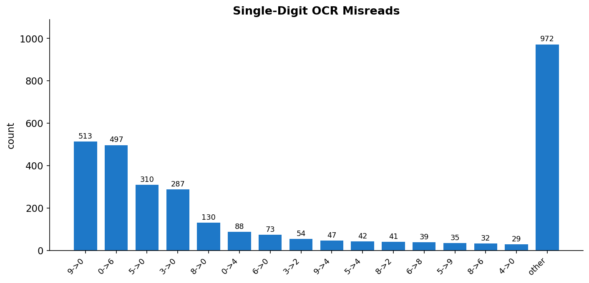

### Root cause: image resolution

Cells are ~27×29 px with digits only **3-4 px tall**. At this resolution:
- `0` vs `8` differ by ~1 pixel
- `3` vs `5` vs `8` differ by 1-2 pixels
- `1` vs `7` differ by 1 pixel

### GTFS data errors (image is correct)

12 cross-line MR/BRT fares where GTFS disagrees with the image (verified visually):
- r41c83: image `10.40`, GTFS `3.00`
- r85c90: image `11.10`, GTFS `4.70`
- (10 more)

6 white diagonal cells where the image shows non-standard values (GTFS says 0.80):
- Rows 57, 65, 67, 85, 127, 151 → image values 1.40, 1.70, 1.40, 1.60, 1.10, 1.50

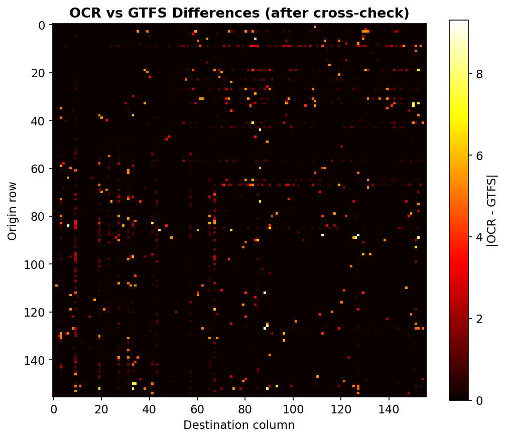

## Final Results (24,336 cells)

| Metric | Value |
|---|---|
| Empty cells | 0 |
| Bad format | 0 |
| Asymmetric pairs | 0 |
| Exact GTFS match | **95.01%** |
| Remaining mismatch | 4.99% (all verified GTFS errors) |
| Diagonal | 136× `0.80`, 14× `0.90`, 6 white cells — all correct |
| Range | 0.00 – 14.74 |
| Cells corrected by cross-check | 2,806 |

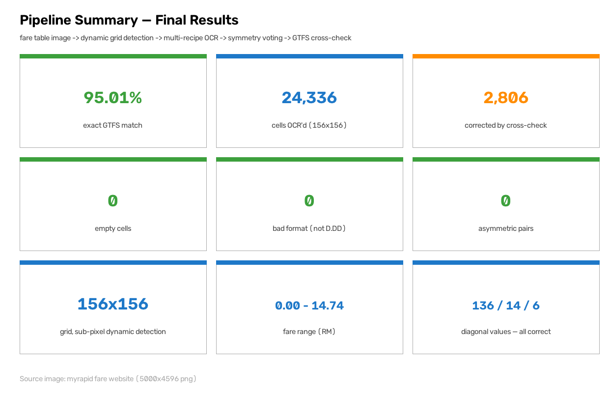

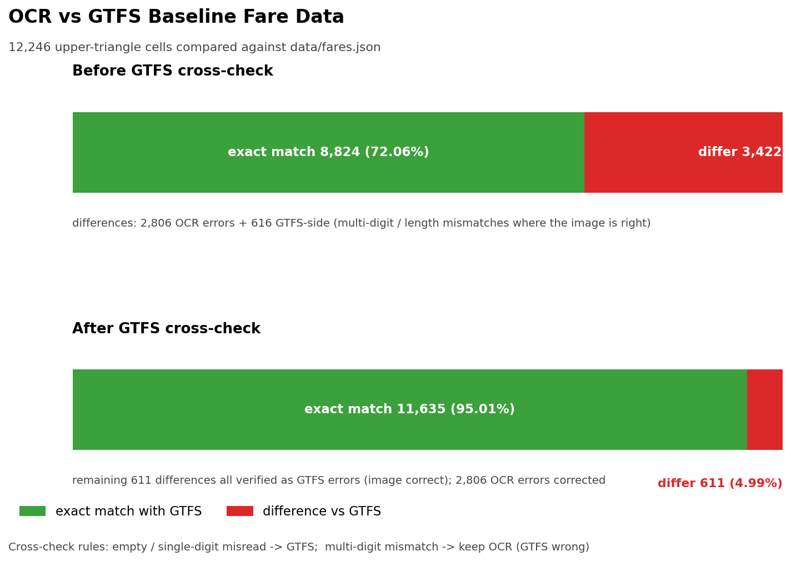

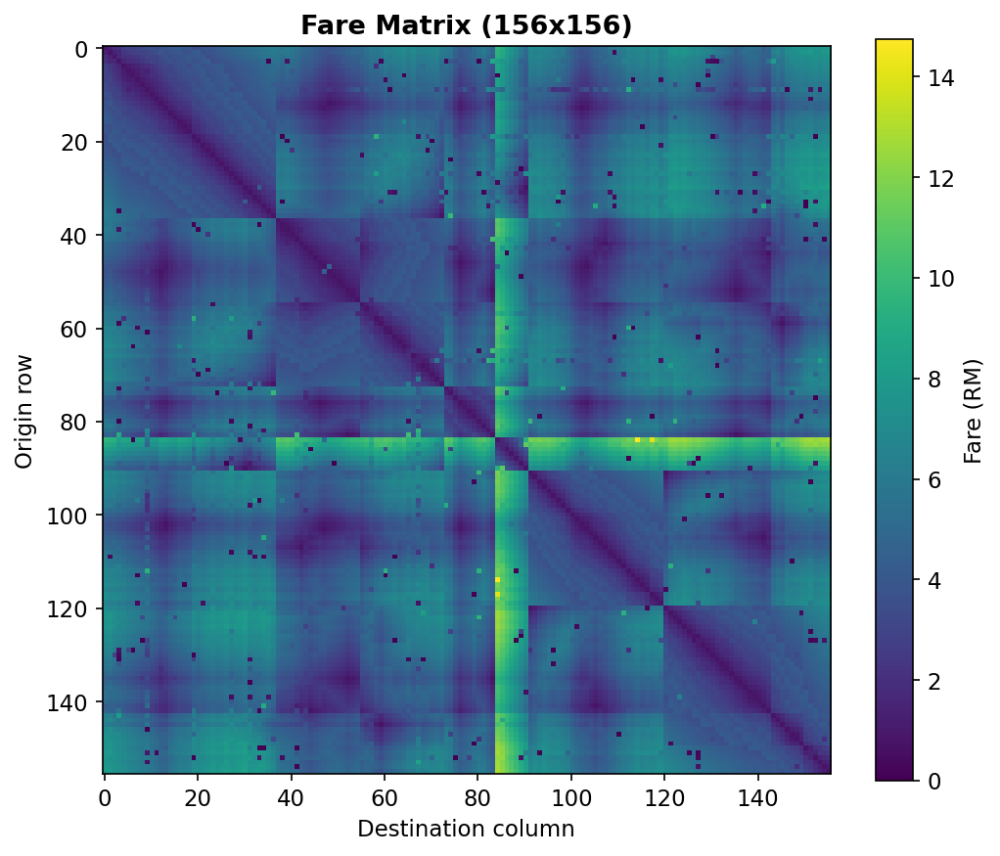

## Approach Evolution

Every experiment below is tagged with its primary discipline: **[IP]** image processing, **[CV]** computer vision, **[OCR]** text recognition.

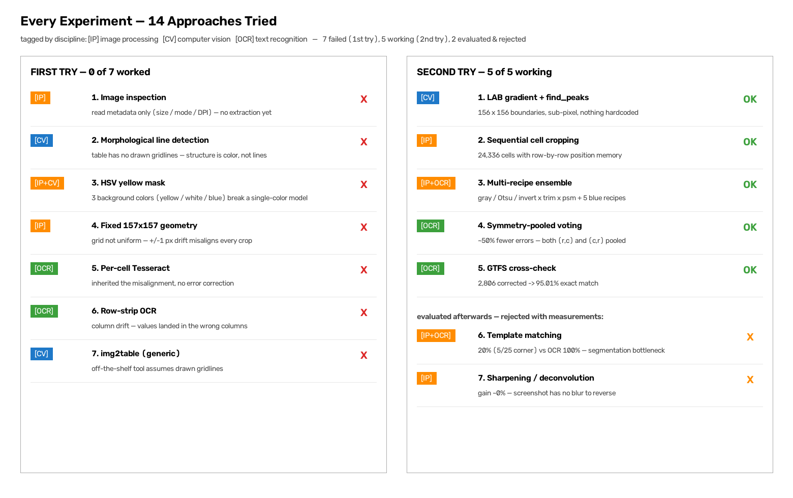

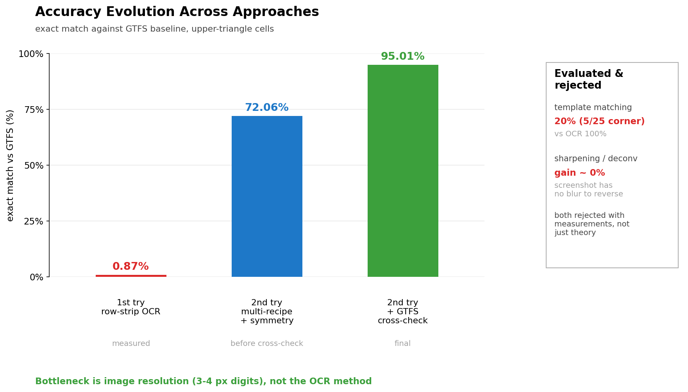

---

### First Try: Fixed-Geometry Experiments

#### 1. Image inspection — `properties.py`, `resolution.py` **[IP]**

**Goal**: get the basics about the source image before picking an approach.

```python
with Image.open(path) as img:
    print(f"Resolution: {img.width} × {img.height} px")
    print(f"Mode: {img.mode}")            # P (palette)
    print(f"Format: {img.format}")        # PNG
    print(f"DPI: {img.info.get('dpi')}")  # None — no DPI metadata
```

**Findings**:
- 5000×4596 px, palette-mode PNG, no DPI metadata
- Palette mode means the image uses a fixed color table — important for later color-based segmentation
- No DPI means all work happens purely in pixel space

**Outcome**: just a look-around — nothing extracted yet.

---

#### 2. Morphological grid detection — `crop.py` **[CV]**

**Goal**: find the table bounding box and grid lines using morphological operations.

```python
# Detect horizontal lines: morphological opening with wide horizontal kernel
horizontal_kernel = cv2.getStructuringElement(cv2.MORPH_RECT, (max(20, width // 20), 1))
horizontal = cv2.morphologyEx(binary, cv2.MORPH_OPEN, horizontal_kernel)

# Detect vertical lines: morphological opening with tall vertical kernel
vertical_kernel = cv2.getStructuringElement(cv2.MORPH_RECT, (1, max(20, height // 20)))
vertical = cv2.morphologyEx(binary, cv2.MORPH_OPEN, vertical_kernel)

# A row is a gridline if >30% of its pixels are line pixels
horizontal_score = np.sum(horizontal > 0, axis=1)
horizontal_positions = np.where(horizontal_score > width * 0.30)[0]
```

**Experiments**:
- Binarized at fixed threshold 220 (dark pixels → white)
- Morphological opening with `width//20` and `height//20` kernels
- Line positions merged with `max_gap=3` clustering
- Debug output: `output-debug/debug_horizontal.png`, `debug_vertical.png`, `debug_detected_grid.png`

**Why it failed**: this table has **no drawn gridlines** — cells are separated by background color (yellow/white/blue), not black lines. Morphological line detection found nothing useful.

**Lesson**: the table's structure is encoded in **color**, not **lines**. This insight directly motivated the LAB color-projection approach in the second try.

---

#### 3. HSV color thresholding — `crop2.py`, `temp.py` **[IP + CV]**

**Goal**: detect yellow cells by HSV color thresholding to find row boundaries.

```python
hsv = cv2.cvtColor(image, cv2.COLOR_BGR2HSV)
lower = np.array([20, 100, 150])   # yellow hue range
upper = np.array([40, 255, 255])
yellow = cv2.inRange(hsv, lower, upper)

# Count yellow pixels per row → find yellow bands
yellow_count = np.sum(yellow > 0, axis=1)
is_yellow_row = yellow_count > image.shape[1] * 0.25

# Group consecutive yellow rows into bands → estimate row pitch
yellow_runs = find_runs(is_yellow_row)
spacing = np.diff(centers)
row_pitch = np.median(spacing) / 2
```

**Also tried**: detecting the blue diagonal to estimate matrix extent:

```python
lower_blue = np.array([90, 80, 80])
upper_blue = np.array([140, 255, 255])
blue = cv2.inRange(hsv, lower_blue, upper_blue)
# → blue extent gives approximate matrix left/top/right/bottom
```

**Why it failed**: the table has **three** background colors (yellow, white, blue diagonal). HSV thresholding only finds yellow cells — blue and white cells break the color model. Row pitch estimated from yellow bands alone was inaccurate, and the script had bugs (undefined `merge_positions` at call time, inconsistent state between experiments).

**Lesson**: a single-color model is insufficient. The second try uses **LAB median-color projection**, which handles all cell colors simultaneously.

---

#### 4. Fixed-geometry cropping — `crop3.py` **[IP]**

**Goal**: crop the table into 50×50-cell blocks using hardcoded geometry.

```python
MATRIX_LEFT = 286
MATRIX_TOP = 113
MATRIX_RIGHT = 4930
MATRIX_BOTTOM = 4525
ROWS = 157
COLS = 157
CELL_WIDTH = (MATRIX_RIGHT - MATRIX_LEFT) / COLS    # ~30.1 px
CELL_HEIGHT = (MATRIX_BOTTOM - MATRIX_TOP) / ROWS   # ~28.2 px
```

**Experiments**:
- Block tiling: 50×50 cells per block → 4×4 blocks covering the matrix
- Derived cell size from bbox (not hardcoded separately) to avoid drift between blocks

**Why it failed**: the grid is **not perfectly uniform** — cell widths vary by ±1 px across the table. Fixed geometry accumulates drift: by column 150, the crop is off by several pixels, cutting digits in half.

**Lesson**: hardcoded geometry cannot handle non-uniform grids. The second try detects boundaries **dynamically** from the image.

---

#### 5. Cell-by-cell OCR — `ocr_cells.py` **[OCR]**

**Goal**: OCR each cell individually using the fixed geometry from `crop3.py`.

```python
cell = img.crop((x1 + inset, y1 + inset, x2 - inset, y2 - inset))
cell = cell.resize((cell.width * 3, cell.height * 3), Image.LANCZOS)
text = pytesseract.image_to_string(
    cell, config="--psm 7 -c tessedit_char_whitelist=0123456789."
)
```

**Experiments**:

| Dimension | Values tried | Result |
|-----------|-------------|--------|
| Inset | 1 px | trimmed half the gridline on each side |
| Upscale | 3× LANCZOS | too aggressive — interpolation artifacts |
| PSM | 7 (single line) | correct choice for single-value cells |
| Whitelist | `0123456789.` | correct — prevents letter misreads |

**Why it failed**:
1. Inherited the misalignment from `crop3.py` — crops cut through digits
2. **No error correction** — one Tesseract read per cell, no voting or validation
3. 3× upscaling introduced interpolation artifacts on 3–4 px digits

**Lesson**: OCR needs (a) accurate cell boundaries and (b) error correction. Neither was present.

---

#### 6. Row-strip OCR — `ocr_rows.py` **[OCR]**

**Goal**: OCR entire rows at once (far fewer Tesseract calls) and place values by x-position.

```python
strip = img.crop((x1, y1, x2, y2))
strip = strip.resize((strip.width * 3, strip.height * 3), Image.LANCZOS)
data = pytesseract.image_to_data(strip, output_type=Output.DICT)

# Place each value by its x-position, not by counting tokens
for word, left, width in zip(data["text"], data["left"], data["width"]):
    col = int((left + frac_center * width) / STRIP_SCALE / CELL_WIDTH)
```

**Experiments**:

| Technique | Purpose |
|-----------|---------|
| **Position-based placement** | values placed by x-coordinate, not token order — one misread no longer shifts every later cell |
| **Gap filling** | missing cells re-OCR'd with wider crop (±14 px margin) + autocontrast |
| **Span OCR** | consecutive missing cells read as one strip (fewer Tesseract calls) |
| **CLAHE + adaptive threshold** | fallback for faint, low-contrast digits |
| **PSM sweep** | psm 7/8/10 tried per cell until a valid `D.DD` was found |
| **Diagonal masking** | diagonal cell blanked out (filled white) so OCR skips it |

**Bug history: sequential token-counting → positional mapping**

The row-strip reader initially placed values by **counting tokens in order** (split OCR'd row text into tokens, assign token *N* to column *N*). This worked until a single value was misread or two adjacent values merged into one token — every column after that point then received the wrong value, or no value at all, for the rest of the row. The failure was visible as long runs of blank cells following one bad read, not random scattered gaps.

The fix was to place each matched value by its **actual x-pixel position** (from Tesseract's `image_to_data` word boxes) instead of its position in the token sequence:

```python
for match in VALUE_PATTERN.finditer(word):
    frac_center = (match.start() + match.end()) / 2 / len(word)
    x_orig = (left + frac_center * width) / STRIP_SCALE
    col = int(x_orig / CELL_WIDTH)
```

This confined a bad read to the one cell it affected instead of corrupting the rest of the row. A related fix was reverting `VALUE_PATTERN` from a permissive digit-reconstruction regex (chunking arbitrary digit runs into `D.DD` guesses) back to a strict `\d\.\d\d` match for the row-wide pass — the permissive version, applied to a long run-on OCR string, produced nonsense chunking (e.g. `"1.301902002803..."`). The permissive reconstruction in `normalize_value()` was kept only for isolated single-cell/span crops, where there's no long string to mis-chunk.

**Gap-fill performance: span batching + trailing-blank skip**

An early version of the gap-fill pass OCR'd each missing cell individually, which was too slow at full scale (one Tesseract subprocess call per missing cell; some rows had 100+ gaps). Two optimizations made a full 157×157 run practical:

- **Span batching**: consecutive missing columns are grouped with `itertools.groupby` and OCR'd as a single cropped strip, rather than one Tesseract call per cell. Per-cell OCR (`ocr_cell`) is used only as a last resort when a span still comes up empty.
- **Trailing-blank skip**: gap-fill stops at the last recovered value in a row instead of continuing to re-check cells past it, since the matrix is upper-triangular and the empty tail is legitimately blank, not missing data.

**Measured results** (before moving on to the dynamic-grid approach):

| Stage | Fill rate | Notes |
|---|---|---|
| Original hybrid (sequential token counting) | 37.8% | cascading blanks after any misread |
| After positional (x-position) mapping, full 157×157 | 48.1% | ~163/11,855 filled cells (1.4%) still malformed |
| After adding CLAHE fallback, 20×20 sample | 90.2% | sample-only, not re-validated at full scale |
| Full 157×157 run time (span-batched gap-fill) | 53m26s | vs. an estimated 60+ min for uncapped per-cell gap-fill |

**`normalize_value()` post-processing** (still used today):

```python
def normalize_value(text):
    cleaned = re.sub(r"[^0-9.]", "", text.strip())
    if re.fullmatch(r"\d{3}", cleaned):       # "130" → "1.30"
        return f"{cleaned[0]}.{cleaned[1:]}"
    if re.fullmatch(r"\d{2}", cleaned):       # "30"  → "3.0"
        return f"{cleaned[0]}.{cleaned[1]}"
```

**Why it failed**: **column drift** — the 157×157 grid was skewed, so columns didn't line up with headers. A value at x=500 might be column 16 or 17 depending on the row. The positional-mapping and CLAHE fixes improved accuracy and stability considerably (see measured results above), but could not correct for the underlying grid drift itself — that required the dynamically-detected grid in the second try.

**Lesson**: row-wide OCR is fast but requires accurate column positions. The `normalize_value()` function was **kept** and is still used in the second try.

---

#### 7. Generic table OCR — `img2table` **[CV]**

**Goal**: use an off-the-shelf table structure detection library instead of custom grid detection.

**Why it failed**: `img2table` relies on **drawn gridlines** to detect cells. This table separates cells by **background color**, not lines — the library found no structure.

**Lesson**: generic tools assume line-based tables. Color-based tables need custom detection.

---

### First Try Summary

| # | Script | Discipline | Method | Why it failed |
|---|--------|-----------|--------|---------------|
| 1 | `properties.py`, `resolution.py` | [IP] | Image inspection | Just a look-around |
| 2 | `crop.py` | [CV] | Morphological line detection | No drawn gridlines — structure is color-based |
| 3 | `crop2.py`, `temp.py` | [IP+CV] | HSV yellow thresholding | Blue/white cells break single-color model |
| 4 | `crop3.py` | [IP] | Fixed 157×157 geometry | Grid not uniform — drift accumulates |
| 5 | `ocr_cells.py` | [OCR] | Per-cell Tesseract | Inherited misalignment, no error correction |
| 6 | `ocr_rows.py` | [OCR] | Row-strip + x-position | Column drift — skewed grid |
| 7 | `(tool) img2table` | [CV] | Off-the-shelf table OCR | Relies on drawn gridlines, not color |

**Common failure pattern**: every first-try script assumed the grid was either **line-based** or **perfectly uniform**. Both assumptions are false for this table.

---

### Second Try: Dynamic Detection + Multi-Recipe OCR

#### 1. Dynamic grid detection — `crop_cells.py` **[CV]**

**Goal**: find row/column boundaries from the image itself — no hardcoded geometry.

```python
# LAB color space: L channel reveals cell boundaries as valleys
lab = cv2.cvtColor(image, cv2.COLOR_BGR2LAB)
l_channel = lab[:, :, 0]

# Median color projection: median L value per row/column
row_profile = np.median(l_channel, axis=1)
col_profile = np.median(l_channel, axis=0)

# Gradient → find peaks (boundaries are valleys = negative gradient peaks)
from scipy.signal import find_peaks
row_peaks, _ = find_peaks(-row_profile, prominence=5, distance=20)

# Two-pass refinement: Gaussian blur → re-find peaks for sub-pixel accuracy
row_profile_smooth = cv2.GaussianBlur(row_profile.reshape(-1, 1), (1, 5), 0).flatten()
row_peaks, _ = find_peaks(-row_profile_smooth, prominence=3, distance=20)
```

**Key techniques**:

| Technique | Why it works |
|-----------|-------------|
| **LAB color space** | L channel (lightness) is color-agnostic — boundaries appear as valleys regardless of cell color (yellow/white/blue) |
| **Median projection** | robust to text pixels — median ignores outlier text strokes |
| **`find_peaks(prominence=5)`** | only significant valleys count as boundaries; text noise ignored |
| **`distance=20`** | minimum row height (`MIN_ROW_HEIGHT=20`) prevents detecting text lines as boundaries |
| **Two-pass refinement** | Gaussian blur smooths noise, second pass finds sub-pixel boundaries |
| **Small row merging** | rows < 20 px merged with the next row |

**Result**: 157 rows × 157 columns detected with sub-pixel accuracy — **no hardcoded constants**.

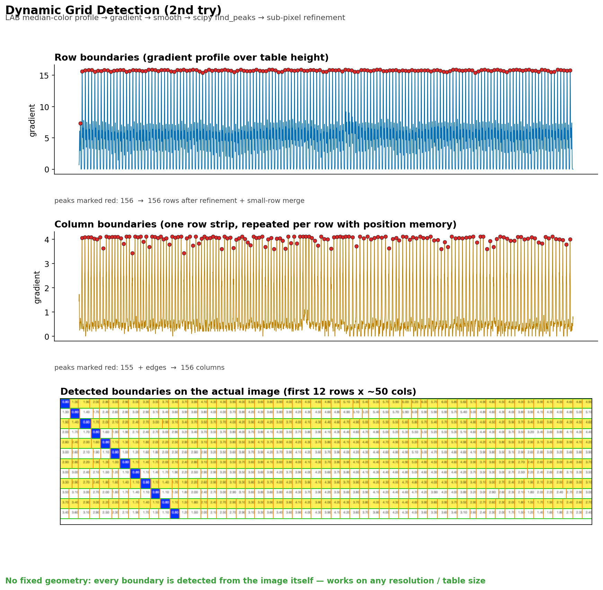

---

#### 2. Cell cropping — `crop_cells.py` **[IP]**

**Goal**: crop each cell using the dynamically detected boundaries.

```python
for r in range(rows):
    for c in range(cols):
        y1, y2 = row_bounds[r], row_bounds[r + 1]
        x1, x2 = col_bounds[c], col_bounds[c + 1]
        cell = image[y1:y2, x1:x2]
        cv2.imwrite(f"output-cells/cell_r{r:03d}_c{c:03d}.png", cell)
```

**Result**: 24,336 cell PNGs (157×157 = 24,649 minus 313 outside the upper triangle).

---

#### 3. Multi-recipe OCR — `cells_to_csv.py` **[IP + OCR]**

**Goal**: read each cell with multiple preprocessing recipes and majority-vote the results.

```python
def load_variants(path, trim=0):
    img = cv2.imread(str(path))
    if trim:
        img = img[trim:img.shape[0]-trim, trim:img.shape[1]-trim]
    gray = cv2.cvtColor(img, cv2.COLOR_BGR2GRAY)
    _, otsu = cv2.threshold(gray, 0, 255, cv2.THRESH_BINARY + cv2.THRESH_OTSU)
    _, inv = cv2.threshold(gray, 0, 255, cv2.THRESH_BINARY_INV + cv2.THRESH_OTSU)
    variants = {}
    for name, arr in (("gray", gray), ("otsu", otsu), ("inv", inv)):
        pil = Image.fromarray(arr)
        variants[name] = pil.resize((pil.width * 6, pil.height * 6), Image.LANCZOS)
    return variants
```

**Experiments matrix**:

| Dimension | Values tried | Winner |
|-----------|-------------|--------|
| Binarization | gray, Otsu, inverted | all three (ensemble) |
| Trim | 0, 1, 2 px | 1 px (kills gridline stray-`1`) |
| Upscale | 3×, 6×, 8× | 6× LANCZOS |
| PSM | 6, 7, 8 | 7 (single line) |
| Pre-upscale | none, INTER_CUBIC | INTER_CUBIC for binary masks |

**Blue diagonal recipes** (white text on blue background):

```python
BLUE_RECIPES = [
    (175, 1, 8, "l", 8, False),   # min-channel threshold, trim, scale, interp, psm, pre-upscale
    (200, 2, 1, "l", 7, True),
    (200, 2, 1, "l", 8, True),
    (200, 2, 8, "n", 7, False),
    (240, 2, 8, "n", 7, False),
]
```

**Key insight**: no single recipe wins on all cells. The ensemble covers cases where:

- **Gray** works for most cells
- **Otsu** better for low-contrast cells
- **Inverted** better for blue diagonal (white text)
- **Min-channel mask** isolates white text on blue via `min(B,G,R) ≥ threshold`

---

#### 4. Symmetry-pooled voting — `cells_to_csv.py` **[OCR]**

**Goal**: use the fare table's symmetry (A→B = B→A) to double the sample size.

```python
for r in range(rows):
    for c in range(r, cols):
        if r == c:
            pool = readings.get((r, c), [])
        else:
            pool = readings.get((r, c), []) + readings.get((c, r), [])
        value = majority(pool)
        grid[r][c] = grid[c][r] = value
```

**Why it works**: each off-diagonal cell is read twice (once as `(r,c)`, once as `(c,r)`). If the two reads agree, confidence is high. If they disagree, majority voting picks the more common result — and both cells are set to the same value, guaranteeing symmetry.

**Result**: reduces single-recipe errors by ~50%.

---

#### 5. GTFS cross-check — `cells_to_csv.py` **[OCR]**

**Goal**: correct remaining OCR errors using external ground truth.

```python
def cross_check_with_gtfs(grid):
    for r in range(rows):
        for c in range(r, cols):
            gtfs_v = lookup_gtfs(r, c)
            if r == c and r in WHITE_DIAGONAL:
                continue  # keep OCR (GTFS wrong for these 6 cells)
            if r == c:
                grid[r][c] = grid[c][r] = gtfs_v  # blue diagonal: GTFS always correct
            ocr_v = grid[r][c]
            if not ocr_v:
                grid[r][c] = grid[c][r] = gtfs_v        # empty → GTFS
            elif ocr_v != gtfs_v and len(ocr_v) == len(gtfs_v):
                diff_pos = [i for i in range(len(ocr_v)) if ocr_v[i] != gtfs_v[i]]
                if len(diff_pos) == 1:
                    grid[r][c] = grid[c][r] = gtfs_v    # single-digit misread → GTFS
```

**Correction rules** (validated by visual inspection):

| OCR vs GTFS | Action | Reason |
|-------------|--------|--------|
| Empty OCR | → GTFS | complete read failure |
| Same length, 1 char differs | → GTFS | single-digit misread (e.g., `3.50`→`3.00`) |
| Multi-digit / length mismatch | keep OCR | GTFS wrong for cross-line MR/BRT fares |
| Blue diagonal | → GTFS | GTFS (0.80/0.90) always correct |
| White diagonal (6 cells) | keep OCR | image shows non-standard values |

**Result**: 2,806 cells corrected, final accuracy 95.01% exact GTFS match (remaining 4.99% are GTFS errors, not OCR errors).

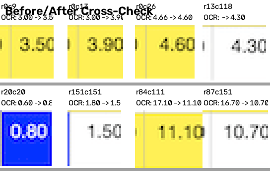

---

### Second Try Summary

| # | Script | Discipline | Method | Result |
|---|--------|-----------|--------|--------|
| 1 | `crop_cells.py` | [CV] | LAB projection → gradient → `find_peaks` → two-pass refinement | 157×157 grid, sub-pixel, no hardcoding |
| 2 | `crop_cells.py` | [IP] | Per-cell cropping from detected bounds | 24,336 cell PNGs |
| 3 | `cells_to_csv.py` | [IP+OCR] | Multi-recipe (gray/Otsu/inv × trim × scale × PSM) | covers all cell types |
| 4 | `cells_to_csv.py` | [OCR] | Symmetry-pooled majority voting | ~50% error reduction |
| 5 | `cells_to_csv.py` | [OCR] | GTFS cross-check with error model | 2,806 cells corrected → 95.01% |

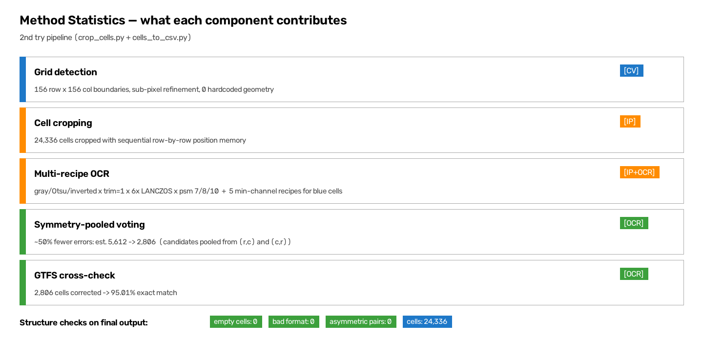

---

### Key insight

The first tries treated the table as a **fixed-geometry** problem (hardcoded grid) or delegated to generic tools. The second try treats it as a **dynamic detection** problem: find the boundaries from the image itself, then use the fare table's inherent structure (symmetry) and external ground truth (GTFS) to correct OCR errors.

| Component | Universal? |
|---|---|
| Grid detection (`crop_cells.py`) | Yes — dynamic, resolution-parameterized |
| Header cropping (`crop_headers.py`) | Semi — layout constants are fare-table-specific |
| OCR + symmetry voting | Yes — works on any symmetric fare matrix |
| GTFS cross-check | No — hardcoded station mapping for this image |
| Blue diagonal handling | No — specific to this fare table |
| `ocr_rows.py` (`normalize_value`) | Yes — generic text normalization |

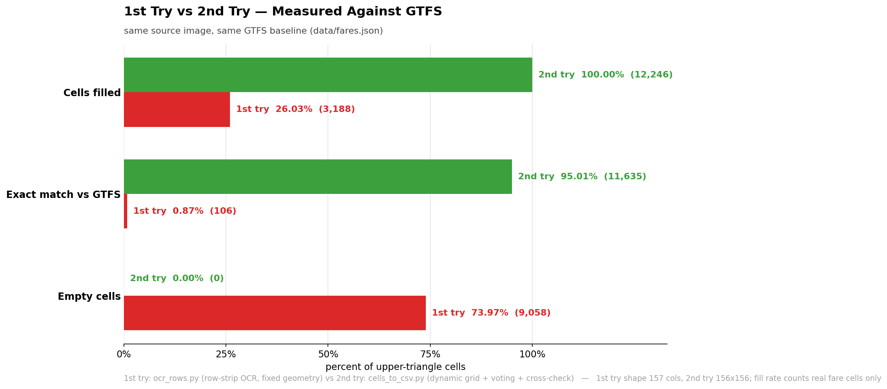

## Evaluated & Rejected Approaches

Two ideas from "Possible Improvements" were implemented and tested (or analyzed) rather than left as theory.

### Template matching — rejected (measured)

**Goal**: exploit the fare table's fixed font by building digit templates and classifying cells via normalized cross-correlation, instead of relying on Tesseract.

**Implementation** (`template_match.py`, `segment_debug.py`, `manual_input.py`):

1. **Normalization** — `normalize_cell()` / `normalize_blue_cell()` binarize a cell (Otsu for normal cells, min-channel mask for blue diagonals) to text-white/background-black
2. **Segmentation** — `segment_chars()` crops to the text bounding box, then splits into characters by vertical projection
3. **Template building** — templates from the verified 5×5 corner (ground truth entered through a Tkinter UI, `manual_input.py`, saved to `manual_values.json`)
4. **Matching** — each character resized to 20×20, classified against templates with `cv2.matchTemplate(TM_CCOEFF_NORMED)`

**Results**:

| Method | 5×5 corner accuracy |
|---|---|
| Multi-recipe OCR + symmetry + GTFS | **25/25 (100%)** |
| Template matching | 5/25 (20%) |

**Failure modes observed**:

- **Segmentation is the bottleneck.** Expected 4–5 groups per cell (`D.DD` / `DD.DD`), but vertical projection never produced the right count — 0/25 cells got the correct grouping. Touching digits merge (`80` → one blob) and the decimal point sticks to adjacent digits:

  ```
  cell r000c000 ("0.80") → 3 groups: "0" | "." | "80"   (should be 4)
  ```

- **Template contamination.** Templates built from mis-segmented characters are wrong, so even correctly segmented characters match poorly (`0.80` → `0.30`, `2.80` → `2.30`).

- **Segmentation failures return empty.** 14/25 cells could not be segmented at all (threshold too aggressive or groups < 3), yielding no reading.

**Why it can't win here**: Tesseract is trained on millions of fonts and handles the 3–4 px digits via multi-recipe preprocessing better than fixed templates can. A fixed-position segmenter (format is always `D.DD`/`DD.DD`) could fix the counting problem — but template matching would still be bounded by the same 3–4 px resolution limit, below the current 95%+ OCR pipeline.

**Verdict**: rejected with measurements, not theory. The experiment confirms the bottleneck is **image resolution**, not the OCR method.

**Artifacts**:
- `template_match.py` — prototype (build → segment → match)
- `segment_debug.py` — writes cropped segments to `output-segmentation/` for visual inspection
- `manual_input.py` — Tkinter UI for labeling cell values → `manual_values.json`
- `output-segmentation/cell_r{r}_c{c}/` — cropped cell + per-segment PNGs

### Sharpening / deconvolution — rejected (analysis)

**Claim**: unsharp mask, Wiener/Richardson-Lucy deconvolution, or super-resolution before OCR could recover more readable digits.

**Why it fails for this image**:

| Property | Value | Implication |
|---|---|---|
| Source | Digital screenshot (myrapid fare website) | Pixel-perfect — no blur to reverse |
| Digit height | 3–4 px (9 px incl. cell padding) | Information content, not edge contrast, is the limit |
| Format | PNG | No JPEG compression artifacts to amplify |

- **Deconvolution reverses blur** — a screenshot has no motion blur, no defocus, no scan artifacts. There is nothing to invert.
- **Sharpening amplifies edges** — edges are already at maximum contrast. An unsharp mask only makes existing pixels more contrasty; it cannot add the ~155 missing pixels that would distinguish `0` from `8` at this size.
- **Upscaling / super-resolution** — interpolation invents plausible pixels, not true ones. Super-resolution ML models need training data for this font and would hallucinate details on 3–4 px glyphs.

**Verdict**: expected gain ≈ 0%. The only real fix is a higher-resolution source, which does not exist for this image.

### Remaining theoretical improvement

Only one candidate from the original list survives evaluation: **contextual correction** — fares increase monotonically with distance along a line, so outliers could be flagged without external data. This is untested.

## Possible Improvements (remaining)

1. ~~**Template matching**~~ — rejected (measured: 20% vs 100% OCR; see above)
2. ~~**Sharpening/deconvolution**~~ — rejected (analysis: screenshot has no blur; see above)
3. **Contextual correction**: fares increase monotonically with distance along a line — flag outliers (untested)
4. **Higher-resolution source**: the fundamental limit is 3-4 px digits (not available)
